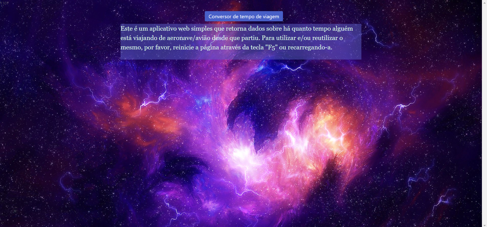
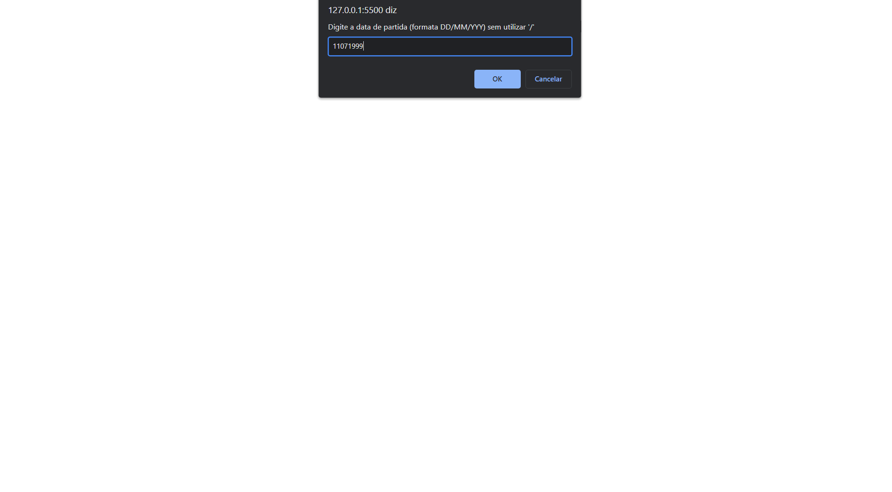
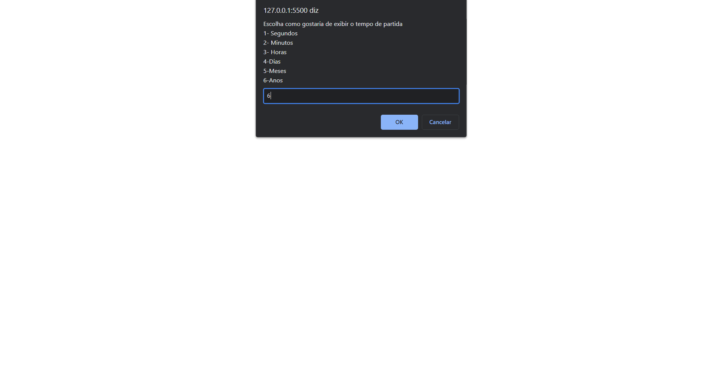

# Conversor de tempo de viagem
 Este mini app converte dados de forma inteira, desde segundos até anos, em relação a por exemplo desde quando alguém viajou e quanto tempo durou ou dura a viagem. Tudo isso dentro da caixa de diálogo do browser. O layout do arquivo é meramente ilustrativo e p fins de prática :)

1st preview:
    

2nd preview:
    

3rd preview:
    

4th preview:
    
